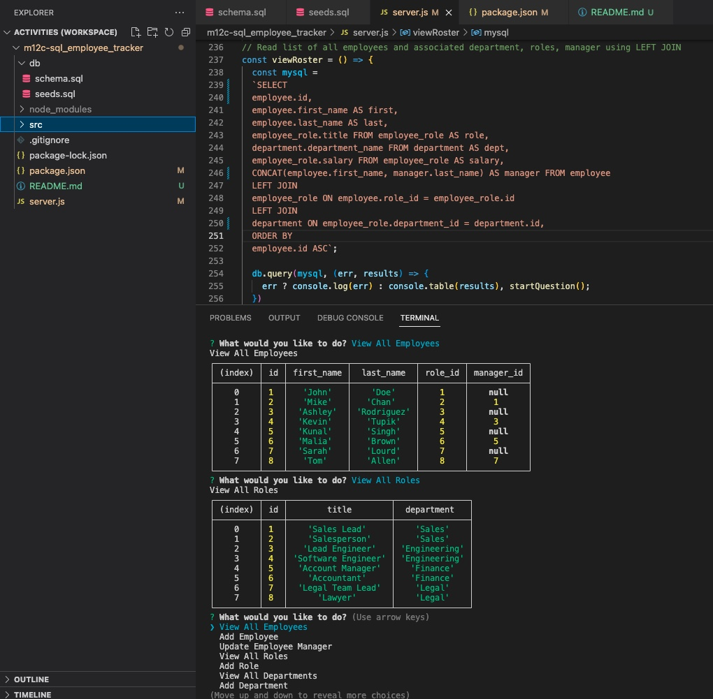

# m12c-sql_employee_tracker
# 
# Date: 26/09/2022, 4:30:02 pm
# GitHub Username: PatrickARatcliff
# Github Repo URL: https://github.com/PatrickARatcliff/m12c-sql_employee_tracker

# Link to demo video: https://drive.google.com/file/d/1feGs0w4Ix8iWOKtT6CUV0fLCt4x-2rV-/view
  
## Table of Contents
- [Project Description](#project-description)
- [Installation Instructions](#installation-instructions)
- [Usage Information](#usage-information)
- [Contribution Guidelines](#contribution-guidelines)
- [Test Instructions](#test-instructions)
- [License](#license)
  
## Project Description
- Using the command line terminal/bash, create an sql database of your employees. Each employee has a unique id#, role, department, and salary. A manaager can also be assigned to new and existing employees. It is possible to view employees, departments, roles, and an integrated roster with information from all three tables. It is also possible to add employees, departments, and roles.
  
## Installation Instructions
- This application requires "express":"^4.17.1" : "inquirer":"^8.2.4" : "mysql2”:”^2.2.5”. Simply copy the root directory from the repo and run "npm i" command from your integrated terminal. You should see the node modules directory populate under the repo used for the integrated terminal.
  
## Usage Information
- To use, simply open m12c-sql_employee_tracker directory with the integrated terminal/bash. type the command "npm run start". Choose an option from the command line and enter all necessary information.
  
## Contribution Guidelines
- To contribute to this project, fork the repository at ‘https://github.com/PatrickARatcliff/m12c-sql_employee_tracker', create a pull request with a description for the change and its location.
  
## Test Instructions
- N/A
    
## License
- MIT License
- m12c-sql_employee_tracker: Command-line application to manage a company's employee database, using Node.js, Inquirer, and MySQL.
- Copyright (c) [2022] [Patrick Ratcliff]. All rights reserved.

    

      Permission is hereby granted, free of charge, to any person obtaining a copy
      of this software and associated documentation files (the "Software"), to deal
      in the Software without restriction, including without limitation the rights
      to use, copy, modify, merge, publish, distribute, sublicense, and/or sell
      copies of the Software, and to permit persons to whom the Software is
      furnished to do so, subject to the following conditions:

      The above copyright notice and this permission notice shall be included in all
      copies or substantial portions of the Software.

      THE SOFTWARE IS PROVIDED "AS IS", WITHOUT WARRANTY OF ANY KIND, EXPRESS OR
      IMPLIED, INCLUDING BUT NOT LIMITED TO THE WARRANTIES OF MERCHANTABILITY,
      FITNESS FOR A PARTICULAR PURPOSE AND NONINFRINGEMENT. IN NO EVENT SHALL THE
      AUTHORS OR COPYRIGHT HOLDERS BE LIABLE FOR ANY CLAIM, DAMAGES OR OTHER
      LIABILITY, WHETHER IN AN ACTION OF CONTRACT, TORT OR OTHERWISE, ARISING FROM,
      OUT OF OR IN CONNECTION WITH THE SOFTWARE OR THE USE OR OTHER DEALINGS IN THE
      SOFTWARE.

    
***[This is an external link to the MIT license](https://en.wikipedia.org/wiki/MIT_License)***
  
---
